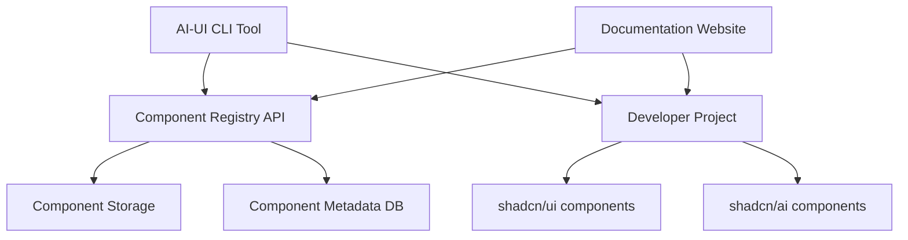
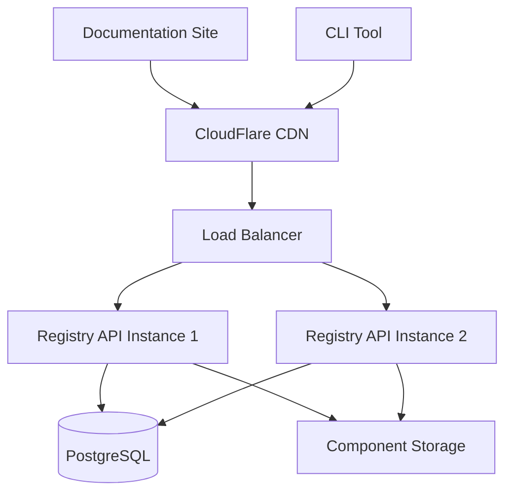

# Design Document

## Overview

This design outlines an advanced AI component registry that extends beyond shadcn/ai's basic chat functionality. The system will provide enterprise-grade AI interface components through a CLI tool and documentation website, following the proven shadcn pattern of code ownership and customization.

The registry focuses on four key areas that are currently missing from the AI UI ecosystem:
1. **AI Transparency & Trust** - Components that make AI decision-making visible
2. **Advanced Interaction Patterns** - Beyond basic chat interfaces  
3. **Enterprise AI Features** - Governance, monitoring, and compliance
4. **Specialized AI Workflows** - Multi-step processes and automation

## Architecture

### High-Level System Architecture



### Component Categories

The registry will organize components into logical categories:

1. **Transparency Components** (`/transparency`)
   - ConfidenceScore
   - ReasoningSteps  
   - SourceAttribution
   - BiasIndicator

2. **Advanced Chat Components** (`/chat`)
   - MultiAgentChat
   - VoiceInterface
   - ThreadBranching
   - ConversationMemory

3. **Input Components** (`/input`)
   - PromptBuilder
   - MultimodalUpload
   - ModelSelector
   - ParameterTuner

4. **Workflow Components** (`/workflow`)
   - PipelineVisualizer
   - BatchProcessor
   - AgentOrchestrator
   - DecisionTree

5. **Enterprise Components** (`/enterprise`)
   - AuditTrail
   - CostTracker
   - ComplianceMonitor
   - SafetyFilter

6. **Analytics Components** (`/analytics`)
   - PerformanceMetrics
   - ConversationAnalytics
   - FeedbackCollector
   - DebugInspector

## Components and Interfaces

### Core Component Structure

Each component will follow this standardized structure:

```typescript
// Component interface
interface AIComponentProps {
  className?: string;
  variant?: 'default' | 'outline' | 'ghost';
  size?: 'sm' | 'md' | 'lg';
  // Component-specific props
}

// Component implementation
export const ComponentName = React.forwardRef<
  HTMLDivElement,
  AIComponentProps
>(({ className, variant = 'default', ...props }, ref) => {
  return (
    <div
      ref={ref}
      className={cn(componentVariants({ variant }), className)}
      {...props}
    />
  );
});
```

### Key Component Designs

#### 1. ConfidenceScore Component

```typescript
interface ConfidenceScoreProps {
  score: number; // 0-1
  threshold?: number;
  showLabel?: boolean;
  variant?: 'bar' | 'circle' | 'badge';
}
```

Visual representation of AI confidence with color coding and threshold indicators.

#### 2. ReasoningSteps Component

```typescript
interface ReasoningStepsProps {
  steps: ReasoningStep[];
  expandable?: boolean;
  showTimings?: boolean;
}

interface ReasoningStep {
  id: string;
  title: string;
  description: string;
  confidence?: number;
  duration?: number;
  evidence?: Evidence[];
}
```

Expandable step-by-step breakdown of AI reasoning process.

#### 3. PromptBuilder Component

```typescript
interface PromptBuilderProps {
  templates?: PromptTemplate[];
  variables?: Variable[];
  onPromptChange: (prompt: string) => void;
  maxTokens?: number;
}
```

Visual prompt construction with templates, variables, and token counting.

#### 4. MultiAgentChat Component

```typescript
interface MultiAgentChatProps {
  agents: Agent[];
  messages: Message[];
  activeAgent?: string;
  onAgentSwitch: (agentId: string) => void;
}
```

Chat interface supporting multiple AI agents with role identification.

### CLI Tool Architecture

The CLI tool will be built with the following structure:

```
ai-ui/
├── src/
│   ├── commands/
│   │   ├── add.ts          # Add component command
│   │   ├── init.ts         # Initialize project
│   │   ├── list.ts         # List available components
│   │   └── update.ts       # Update components
│   ├── utils/
│   │   ├── registry.ts     # Registry API client
│   │   ├── project.ts      # Project detection
│   │   └── installer.ts    # Component installation
│   └── index.ts
```

### Registry API Design

The registry API will provide the following endpoints:

```typescript
// GET /api/components
interface ComponentListResponse {
  components: ComponentMetadata[];
  categories: Category[];
}

// GET /api/components/:name
interface ComponentResponse {
  metadata: ComponentMetadata;
  files: ComponentFile[];
  dependencies: Dependency[];
}

interface ComponentMetadata {
  name: string;
  category: string;
  description: string;
  version: string;
  tags: string[];
  dependencies: string[];
  examples: Example[];
}
```

## Data Models

### Component Registry Schema

```typescript
interface Component {
  id: string;
  name: string;
  category: ComponentCategory;
  description: string;
  version: string;
  files: ComponentFile[];
  dependencies: Dependency[];
  examples: Example[];
  documentation: string;
  tags: string[];
  createdAt: Date;
  updatedAt: Date;
}

interface ComponentFile {
  path: string;
  content: string;
  type: 'component' | 'types' | 'styles' | 'utils';
}

interface Dependency {
  name: string;
  version: string;
  type: 'npm' | 'peer' | 'dev';
}
```

### Project Configuration

The CLI will extend the existing `components.json` configuration:

```json
{
  "$schema": "https://ui.shadcn.com/schema.json",
  "style": "new-york",
  "rsc": true,
  "tsx": true,
  "tailwind": {
    "config": "",
    "css": "app/globals.css",
    "baseColor": "neutral",
    "cssVariables": true,
    "prefix": ""
  },
  "aliases": {
    "components": "@/components",
    "utils": "@/lib/utils",
    "ui": "@/components/ui",
    "ai": "@/components/ai"
  },
  "registries": {
    "ai-ui": {
      "url": "https://ai-ui.dev/registry",
      "components": ["confidence-score", "reasoning-steps"]
    }
  }
}
```

## Error Handling

### CLI Error Handling

1. **Network Errors**: Graceful fallback with cached components
2. **Project Detection**: Clear guidance for unsupported projects  
3. **Dependency Conflicts**: Automatic resolution with user confirmation
4. **File Conflicts**: Backup and merge strategies

### Component Error Boundaries

Each component category will include error boundary components:

```typescript
export const AIComponentErrorBoundary: React.FC<{
  children: React.ReactNode;
  fallback?: React.ComponentType<{ error: Error }>;
}>;
```

## Testing Strategy

### Component Testing

1. **Unit Tests**: Jest + React Testing Library for each component
2. **Visual Tests**: Storybook with Chromatic for visual regression
3. **Accessibility Tests**: axe-core integration for WCAG compliance
4. **Performance Tests**: React DevTools Profiler for render performance

### CLI Testing

1. **Command Tests**: Test CLI commands in isolated environments
2. **Integration Tests**: Test full component installation flow
3. **Project Tests**: Test against various project configurations

### Registry Testing

1. **API Tests**: Comprehensive endpoint testing
2. **Load Tests**: Performance testing for component delivery
3. **Security Tests**: Input validation and authentication

## Performance Considerations

### Component Optimization

1. **Code Splitting**: Dynamic imports for large components
2. **Tree Shaking**: Optimized exports for minimal bundle size
3. **Memoization**: React.memo for expensive components
4. **Virtualization**: For components handling large datasets

### Registry Performance

1. **CDN Distribution**: Global component delivery
2. **Caching Strategy**: Aggressive caching with versioning
3. **Compression**: Gzip/Brotli for component files
4. **Lazy Loading**: Progressive component discovery

## Security Considerations

### Component Security

1. **Input Sanitization**: XSS prevention in all components
2. **Content Security Policy**: CSP headers for documentation
3. **Dependency Scanning**: Automated vulnerability detection
4. **Code Review**: Manual review for all component submissions

### Registry Security

1. **Authentication**: API key management for CLI
2. **Rate Limiting**: Prevent abuse of registry endpoints
3. **Input Validation**: Strict validation of component metadata
4. **Audit Logging**: Track all registry operations

## Deployment Architecture

### Infrastructure



### Deployment Pipeline

1. **Component Validation**: Automated testing and validation
2. **Registry Deployment**: Blue-green deployment for zero downtime
3. **Documentation Updates**: Automatic documentation generation
4. **CLI Distribution**: NPM package publishing

This design provides a comprehensive foundation for building an advanced AI component registry that extends the shadcn ecosystem with enterprise-grade AI interface components.